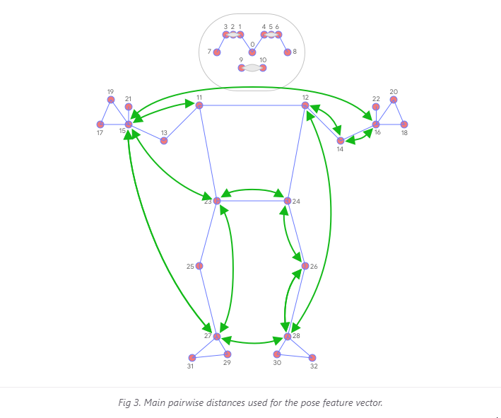

# ZenAI-3YP

# 5 Yoga Pose Classifying
1. **Warrior**
2. **Tree**
3. **Cobra**
4. **Plank**
5. **Downward dog**

## First Steps 
- Play with MediaPipe 
- Research into CNNs and understand how they're used in classification 
- Understand 1 model and try to re-train it using own data set...?

### Notes:
* https://colab.research.google.com/drive/19txHpN8exWhstO6WVkfmYYVC6uug_oVR (K-NN Pose classifer) Kinda how it works
    - Convert key points into feature vectors (Eyes, Wrists, etc..)
    - Calculate pairwise distance between predefined set of pose joints
        - _Since algo relies on distance, all poses are normalized to have same torso size and vertical torso orientation_
    - 
    - To get better classification - KNN is invoked twice with different distance metrics
        - First to filter out samples that are _almost_ the same as the target with only a few differnces in the features vectors (e.g Slightly bent joints)
        - Secondly the average per-coordinate distance is used to the find the nearest pose cluster among those from the first search
            - _i.e Create first group that gets pretty much all the same images, then second group to find nearest pose among the near idententical images_
    - To clear the noise and smooth data, apply [Exponential Moving Average (EMA)](https://en.wikipedia.org/wiki/Moving_average#Exponential_moving_average) - Also, we can do soft KNN and calculate a probabilty for each cluster 
    - [Source](https://google.github.io/mediapipe/solutions/pose_classification.html)