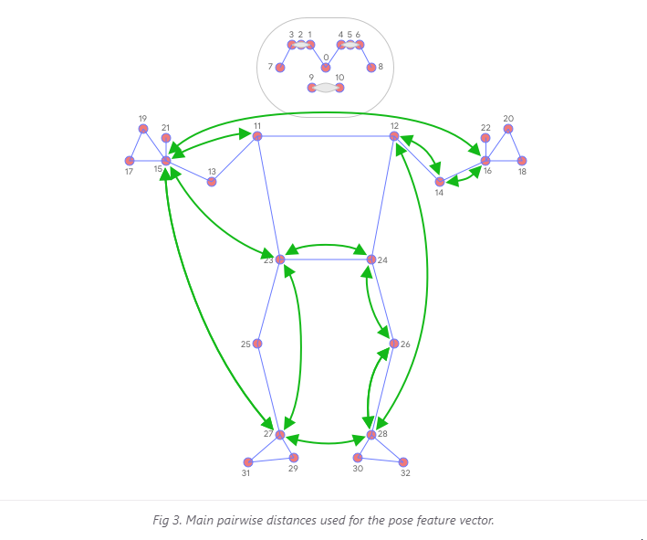
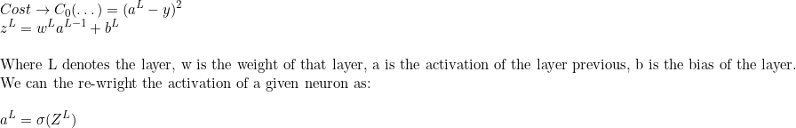

# ZenAI-3YP

# 5 Yoga Pose Classifying
1. **Warrior**
2. **Tree**
3. **Cobra**
4. **Plank**
5. **Downward dog**

## First Steps 
- Play with MediaPipe 
- Research into CNNs and understand how they're used in classification 
- Understand 1 model and try to re-train it using own data set...?
- Use Neural Networks to classify (Easier to implement) 

### Plan
- Use MediaPipe to extract key body points 
- Feed these points into another classify specifically trained on yoga models 
- Then develop feedback algorithm within mediapipe + cv2 

### Notes:
* Firstly using [MediaPipe](https://google.github.io/mediapipe/)
* https://colab.research.google.com/drive/19txHpN8exWhstO6WVkfmYYVC6uug_oVR (K-NN Pose classifer) Kinda how it works
    - Convert key points into feature vectors (Eyes, Wrists, etc..)
    - Calculate pairwise distance between predefined set of pose joints
        - _Since algo relies on distance, all poses are normalized to have same torso size and vertical torso orientation_
    - 
    - To get better classification - KNN is invoked twice with different distance metrics
        - First to filter out samples that are _almost_ the same as the target with only a few differnces in the features vectors (e.g Slightly bent joints)
        - Secondly the average per-coordinate distance is used to the find the nearest pose cluster among those from the first search
            - _i.e Create first group that gets pretty much all the same images, then second group to find nearest pose among the near idententical images_
    - To clear the noise and smooth data, apply [Exponential Moving Average (EMA)](https://en.wikipedia.org/wiki/Moving_average#Exponential_moving_average) - Also, we can do soft KNN and calculate a probabilty for each cluster 
    - [Source](https://google.github.io/mediapipe/solutions/pose_classification.html)

* https://ai.googleblog.com/2020/08/on-device-real-time-body-pose-tracking.html
    - Current standard [Coco Topology](https://cocodataset.org/#keypoints-2020) Uses 17 Landmarks across torso, face, legs and arms. Not enough detail for ankle and wrist orientation which would be key for fitness applications 
    - BlazePose (ML Pose detection engine for mediapose) uses 33 Keypoints - shown above 
    - Yoga use case 
        - 

# Neural Networks 
## Emergance of Deeplearning
- Drawbacks of machine learning that were solved with deeplearning
    - Unable to process high dimensional data
    - Feature engineering is manual in machine learning (Time consuming)
    - Not ideal for image process / object detection **Key Point for ZenAI**
    - Not efficient with multiple data points 
## Components of Neural Network
- Input Layer
- Hidden Layer 
- Output Layer
- Weights and Bias
- Acitivation Function 
- Loss Function 
### What are layers
- Layers are used to hold neurons and pass it on to the subsequent layers
    - Each neuron is a mathametical operation that takes its input, multiples it by the weight associated with it, and passes the sum through the activation function to the other neurons 
- Input layer accepts all inputs provided by the user 
- Input goes through a series of transformations through hidden layers 
- Then finally goes into output layer
### What are weights and bias'
- Weights are value's assoiciated with the input that means how much importance that input has to calculate the desired output **The priority of the input**
- They are optimised during the training phase (*w vec*)
- Intially all the weights are random 
- **Bias** Constant added to product of features and weights, to offset the activation function 
### Activation Function 
- Computes the output from the weighted sum of inputs 
- 

## FeedFoward 
- Weights are taken randomly and outputs are calculated using activation function 

## BackPropgation
- Weights are updated to minimize the calcualted error 

# [3B1B NN Video](https://www.youtube.com/watch?v=aircAruvnKk&ab_channel=3Blue1Brown) Notes
## Part 1 - What is NN
- Breif Definition
    - A NN is simply a function that takes some inputs through neurons, and returns an output through neurons, where there are hidden layers in the middle that alter the values of neurons during the algorithm to provide a different output depending on what was fed into the network. 
- Neuron is a cell that holds a number (*More correctly it's a function that takes the inputs of all the neurons before it and spits out a value*) 
    - NN starts M\*N Neurons (Each correleating to the pixle value in the M\*N Image) [\*This is for the case of classifying numbers*]
    - The number in a neuron is called it's activation 
- **Why layers?**
    - As layers get deeper, you can imagine each neuron is set to detect certain patterns/shapes. 
        - E.g a neuron will have a high activation if one part of the image contains a loop near the top (This will indicate the number may be a 9 or an 8)
        - Since the image will have a combination of features like this, it will piece together these parts of the image to get an activation for the actual the number
        - But how does it figure out what a loop is?
            - Since a loop can be split up into multiple different edges, ideally the layers neurons before it each has a edge or a 'sub component'
            - Then it all recursivley builds up untill the very first layer where it's just 1 pixle from the input 
- Matrix Notation
- 
- Each **row** in the Weights Matrix contains all the weights for a **Single** neuron in the next layer 
- And the **A** Matrix is just each neuron in the layer, so multiplying the weight row by the column vector of A
    - Will result in the column of vector for the next layer which indicates **Those** neurons values 
- Then to add a bias, just create a Bias vector where each value is the **Bias for a single neuron in the next layer**
    - And we can sum the product of WA and BiasVec to get the activation value for a neuron *(And wrap this all around sigmoid function to get value between [1, 0])*

- **Note:**
    - Sigmoid function was mainly used in traditional deep learning 
    - A more common function is an ReLU function which is just `max(0, a)`
    - Using sigmoid was a *slower* learner than ReLU funciton 
## How does a NN Learn 
- Quick Recap
    - Each layer in the NN built up the input to hopefully build an image of the output
    - E.g First layer just the pixel values of the image 
    - Second layer built up different line segments in parts of the image
    - Third layer built up different shapes in the image like a circle etc
    - Last layer combined all these shapes and built up an image of a number 
- Cost Function
    - **Mean squared difference** -> Take the difference between expected output and actual output and square these values, then sum all of them together and that's the cost of training example 
    - Take **avg cost** over all training examples, and that's the measure of how good the model has been trained 
    - `C(w)` - We want to minimse this function
        - We could find the gradient of that function, and then move it left if the gradient is positive or right if it's negative  
        - Do this enough and eventually we'll find a **local minimum** (Not Global)
        - We can also make our step size proportional to the slope of our gradient i.e Small step for near flat gradients (This can prevent overshooting)
        - If we increase our dimensions, now we need to minmise `C(x, y)`
            - We can use multi-variable calculuse to find the `ΔC(x,y)` to know which direction to step
    - **Using this concept** we can imagine it like this 
    
        - And we update our *W* Vector by adding to the values, our `-gradient` (We use '-' here as we want to minmise our cost func)
        - And these *nudges* are the numbers to minimse our cost function by the highest amount (From before where we calculated the derivative)
        - This is also a good way to be able to visualise gradient in **high-dimensional space**
            - Sign of the gradient is an indication if you should go up or down in that dimension
            - The value of the gradient is how far up or down you should go in that dimension
            - *Note: The number of rows in the vector is the number of dimensions*
        - Simple terms, higher the value in the gradient vector, the more influence it has on minmising the cost function/

## Back Propagation   
- **Backpropgation** is the method of updating our weights and biases in each layer to minimse the cost function as much as possible, thus leading to a more accurate model 
- Example: We want to classify this 2, and currently the outputs are not very accurate 

    - We want to increase the value of the output "2" Neuron and decrease the values of all the other output neurons 
    - To increase the value of an output neuron we can do 3 things to it 
    
        - Increase it's bais 
        - Increase it's weights (These are proportial to the activation value of the neuron the weight is connected to)
        - Change the actiation value of neuron before it (This will be in proportion to it's current weight)
            - So for neurons with a negative weight, we want to decrease this activation
            - And for neurons with positive weight we want to increase it 
    - So now we know what we want to do to the activation value for all the neurons in the layer before **FOR ONE OUTPUT NEURON** 
    - We must think about this in relation to what we want to do to for **ALL NEURONS IN THE CURRENT LAYER**
    - This is why the activation values of a neuron is a sum of changes, turning **THIS** 
    - Into **this** 
    - And we can do this recursivley all the way down to the first layer of the NN 
- We then repeat this *whole* process for every other number we want to classify, the average these changes over the whole data and this result is the changes and nudges that we want to apply, (*And what we were talking about in the previous section, in terms of the negative gradient of the cost function*)
- This, as you can imagine, is very computationally expensive. One way we can speed this up is to use *Stochast Gradient Descent* where we first, for example, split up the data into batches of 10*100Examples (Called mini-batches), and then calculate the negative graident of the cost function each 100 Examples (As opposed to all 1000 Examples) then use each mini-batch to get the change in weights and biases, which will eventually converge to a local minimum

## Back Propagation Calculus 
- **Lets, for a moment, imagine a very simple NN, with only 1 connection at each layer** 

- We can use the following algebra to nicley define the cost function of a NN.
- 
- So we can use all of this to create a tree to calculate the cost of a NN, where it's recursive interms of a^(L) 
- Now we can calculate how the change in the weight of a layer can effect the cost function using the chian rule, Since they all relate the layer above- it can be visualized as follows: 
- **Calculating Derivatives** 
    - If we break this down, it can quite simple if we just make use of the equations we created before hand. 
    - 
    - **Note: This was for calculating the change to the weight**
    - Calculating the change to the bias is very simple as all it takes is swapping the weight and the bias, and the derivative of the Bias just comes out to 1 anyway since it's some constant. 
    - And finally calculating the change to the activation of the previous node is a similar process, where we replace the bias with the activation of L-1 as so 
        - *Note* The derivative of the Z^L wrt. A^L-1 = W^L 
- Now we can just expand this logic our to NN with multiple neurons at each layer, but this time we just need to subscript which neuron we're taking into consideration. 
- Our cost function changes slightly to take the meansquared of the differences  
- However, our chain rule to find the derviatve of the cost WRT to different featuers looks pretty much the same. Just with some extra subscripts
- 
- However, the deriviative of cost function WRT the neuron in the layer before it is slighty changed, since each neuron now has influence on *multiple* neurons in the layer after it. So we must take all of these into account 
